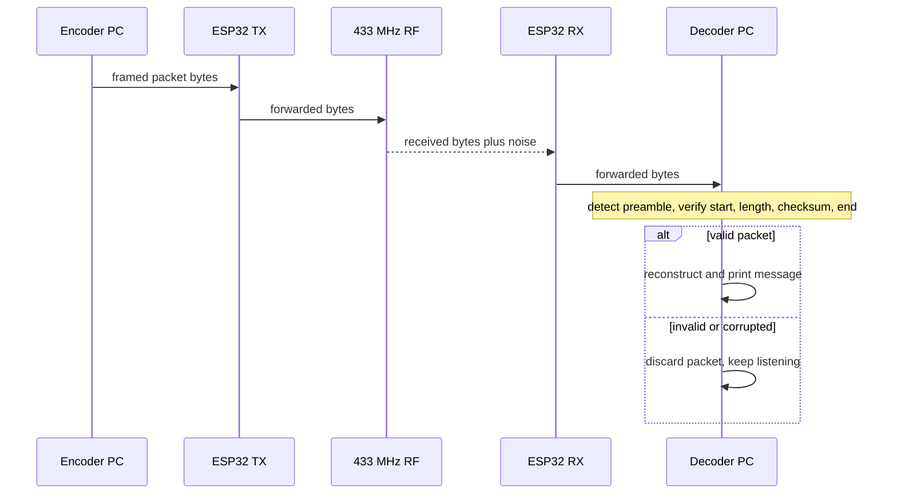
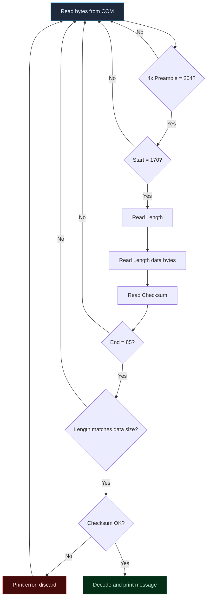

# RF Packet Protocol

### Low-Level Binary Communication over 433 MHz RF

---

## Overview

| What | Detail |
| ---- | ------ |
| **System** | A wireless byte-level communication system using **two ESP32** boards and **433 MHz** RF transmitter/receiver modules [1]. |
| **Goal** | Transmit data from one computer to another **without wires** [1]. |
| **Key feature** | A **custom binary packet protocol** with preamble, start byte, length, checksum, and end byte [1]. |
| **Why needed** | The RF link is noisy and unreliable, so data is framed, synchronized, and checksum-verified before being accepted [1]. |

The message is typed on the sending host, framed into a binary packet, sent to a transmitting ESP32 over USB serial, relayed over the air by an RF module, recovered by a second ESP32, and decoded on the receiving host so the original message appears on the serial monitor [1].

## Motivation / Problem

Direct RF communication is unreliable. The problems observed when sending raw data over the link [1]:

- RF modules are affected by **noise and interference** → errors in data transmission [1].
- **No synchronization** between transmitter and receiver [1].
- **No error detection** [1].

**Result:** raw transmission produced **garbage output** — mostly random, unreadable characters [1].

> **Solution:** add start and end markers (full packet framing) so that only correct messages are accepted, noise is ignored, and errors are detected [1].

## Objectives

- Design a wireless communication system using ESP32 and RF modules [1].
- Transmit data from one device to another without wires [1].
- Understand serial (UART) communication between microcontrollers [1].
- Study the effect of noise and errors in RF communication [1].
- Implement a basic method to reduce errors using start and end markers [1].
- Display received data correctly on the serial monitor [1].

## Features

| Feature | Detail |
| ------- | ------ |
| **Custom packet protocol** | Explicit framing: preamble, start, length, data, checksum, end [1]. |
| **Synchronization** | Preamble of repeated `204` bytes detects the start of a packet and stabilizes the signal [1]. |
| **Length field** | Tells the receiver exactly how many data bytes to read [1]. |
| **Error detection** | Checksum = sum of data bytes `% 256` [1]. |
| **Byte-level encode/decode** | Host message → flat binary payload; receiver → characters [1]. |
| **UART bridging** | Two independent UART channels on each ESP32 (host ↔ ESP32, ESP32 ↔ RF) [1]. |
| **Unreliable 433 MHz channel** | Protocol-level filtering of noise and garbage [1]. |
| **Encoder / Decoder** | Separate C++ host programs on each side [1]. |
| **Debug echo** | Optional loopback path in the transmitter firmware [1]. |

## Architecture

The system splits into a **transmitter section** and a **receiver section** joined by a 433 MHz RF link [1].

- **Transmitter:** PC (encoder) → ESP32 (UART0 in) → ESP32 (UART2 / TX2 out) → RF transmitter.
- **Receiver:** RF receiver → ESP32 (UART2 / RX2 in) → ESP32 (UART0 out) → PC (decoder).

```mermaid
flowchart LR
    PC1["PC · Encoder<br/>C++"]
    TX["ESP32<br/>Transmitter"]
    RFTX["433 MHz<br/>RF Transmitter"]
    RFRX["433 MHz<br/>RF Receiver"]
    RX["ESP32<br/>Receiver"]
    PC2["PC · Decoder<br/>C++"]

    PC1 -->|UART0| TX
    TX -->|UART2 · TX2 · GPIO17| RFTX
    RFTX -->|433 MHz RF| RFRX
    RFRX -->|UART2 · RX2 · GPIO16| RX
    RX -->|UART0| PC2

    classDef host fill:#1e293b,stroke:#38bdf8,color:#e0f2fe
    classDef esp fill:#064e3b,stroke:#34d399,color:#d1fae5
    classDef rf fill:#7c2d12,stroke:#fb923c,color:#ffedd5

    class PC1,PC2 host
    class TX,RX esp
    class RFTX,RFRX rf
```



## System Workflow / Data Flow

1. User enters a message on the transmitting host.
2. **Encoder** frames it into a binary packet.
3. Packet bytes written to the transmitter ESP32 over UART0.
4. ESP32 relays bytes to the RF transmitter over UART2.
5. RF channel carries the bytes (unreliable and noisy).
6. Receiver ESP32 relays incoming bytes to the host over UART0.
7. **Decoder** detects a valid frame, verifies it, and prints the message.



## Technical Design

> **Key decision:** framing and validation live on the **host** (encoder/decoder). The ESP32 firmware is a **byte relay** between its two UART channels. The RF link is treated as an untrusted byte pipe, so correctness is enforced entirely by the protocol [1].

| Part | Purpose |
| ---- | ------- |
| **Preamble** (repeated `204`) | Synchronization — signals data is starting; stabilizes the noisy signal [1]. |
| **Start byte** (`170`) | Marks where the real message data begins [1]. |
| **Length** byte | How many data bytes follow (how much to read) [1]. |
| **Checksum** | Error detection — sum of data bytes `% 256` [1]. |
| **End byte** (`85`) | Marks the end; receiver stops reading here [1]. |

## Core Implementation

### Protocol / Packet Format

On-air layout [1]:

```
[Preamble] [Start] [Length] [Data...] [Checksum] [End]
```

| Field    | Value / Size         | Purpose |
| -------- | -------------------- | ------- |
| Preamble | `204` × 4            | Synchronization; stabilizes the signal [1] |
| Start    | `170`                | Marks start of the message [1] |
| Length   | 1 byte               | Number of data bytes to read [1] |
| Data     | `Length` bytes       | Message as ASCII byte values [1] |
| Checksum | 1 byte               | `(sum of data bytes) % 256` [1] |
| End      | `85`                 | Marks the end; stop reading [1] |

### Worked example — message `"HI"`

ASCII values: `H → 72`, `I → 73` [1].

| Step | Result |
| ---- | ------ |
| **1. Data** | `72 73` [1] |
| **2. Length** | `2` (two characters) [1] |
| **3. Checksum** | `72 + 73 = 145` → `145 % 256 = 145` [1] |
| **4. Preamble** | `204 204 204 204` [1] |
| **5. Start** | `170` [1] |
| **6. End** | `85` [1] |

**Final on-air packet:**

```
204  204  204  204  170  2  72  73  145  85
```

### Encoding (transmitting host, C++)

Reads a message → converts each character to its ASCII byte → computes checksum and length → assembles the packet → writes it to the COM port [1].

```cpp
void encode(const std::string &message) {
    data.clear();
    for (char c : message)
        data.push_back((uint8_t)c);
    calculateChecksum();
    calculateLength();
    buildPacket();
}

void calculateChecksum() {
    int sum = 0;
    for (auto c : data)
        sum += c;
    checksum = sum % 256;
}

void buildPacket() {
    encodedMessage.clear();
    for (int i = 0; i < 4; i++)
        encodedMessage.push_back(PREAMBLE); // 204
    encodedMessage.push_back(START);        // 170
    encodedMessage.push_back(checkLength);
    encodedMessage.insert(encodedMessage.end(), data.begin(), data.end());
    encodedMessage.push_back(checksum);
    encodedMessage.push_back(END);          // 85
}
```

The packet is written to the COM port (e.g. `COM3`) at **2400 baud** via the Windows `WriteFile` call, then relayed over the air [1]:

```cpp
WriteFile(hSerial, packet.data(), packet.size(), &bytesWritten, NULL);
```

> `buildPacket()` creates the final packet by adding preamble, start byte, length, data, checksum, and end byte **in the proper order** [1].

### Decoding (receiving host, C++)

Continuously reads bytes and does **not** trust incoming data — it detects a valid packet structure first (see *Detailed Operation* and *Error Handling / Validation*) [1].

## Detailed Operation

### Transmitter firmware (ESP32)

```cpp
void setup() {
  Serial.begin(2400);                              // PC <-> ESP
  Serial2.begin(2400, SERIAL_8N1, 16, 17);        // ESP <-> RF (TX2)
}

void loop() {
  if (Serial.available())            // PC -> ESP -> RF
    Serial2.write(Serial.read());

  if (Serial2.available())           // Debug (optional)
    Serial.write(Serial.read());
}
```

- `Serial.begin(2400)` — link to the computer [1].
- `Serial2.begin(2400, SERIAL_8N1, 16, 17)` — link to the RF transmitter (TX2/RX2) [1].
- `loop()` — on data from the PC, read via `Serial.read()` and write via `Serial2.write()`; optional debug echoes `Serial2` back to the monitor [1].

### Receiver firmware (ESP32)

```cpp
#define RX2_PIN 16
#define TX2_PIN 17

void setup() {
  Serial.begin(2400);                                 // PC (decoder reads this)
  Serial2.begin(2400, SERIAL_8N1, RX2_PIN, TX2_PIN);
}

void loop() {
  while (Serial2.available()) {
    char c = Serial2.read();
    Serial.write(c);                                  // RF -> PC
  }
}
```

- `Serial.begin(2400)` — output displayed/read by the decoder [1].
- `loop()` — reads bytes from the RF receiver over `Serial2` and forwards them to the PC over `Serial` [1].

### Step-by-step decode pipeline

| # | Step |
| - | ---- |
| 1 | **Detect preamble** — 4 consecutive `204`; otherwise ignore data |
| 2 | **Check start byte** — must be `START = 170`; else reject and reset |
| 3 | **Read length** — how many data bytes to read |
| 4 | **Read data** — read exactly `length` bytes (e.g. `72 73`) |
| 5 | **Read checksum** — next byte (e.g. `145`) |
| 6 | **Check end byte** — last byte must be `END = 85`; else reject [1] |
| 7 | **Extract data** — separate the payload and store it [1] |
| 8 | **Verify length** — `checklength != data.size()` → invalid [1] |
| 9 | **Verify checksum** — `sum % 256 == checksum`; else print error, discard [1] |
| 10 | **Decode message** — each byte → character (e.g. `72 → H`, `73 → I`) [1] |
| 11 | **Display output** — e.g. `Decoded Message: HI` [1] |



## Hardware

| Component | Role |
| --------- | ---- |
| **2 × ESP32** | One transmitter, one receiver; built-in UART [1]. |
| **433 MHz RF transmitter** | Sends data wirelessly as radio signals [1]. |
| **433 MHz RF receiver** | Receives the radio signals [1]. |
| **2 × USB cable** (Type-A to Micro-USB) | Power + data for each ESP32 [1]. |
| **Arduino Uno** (or any regulated 5 V supply) | Stable 5 V for the RF modules, which don't work properly at low voltage [1]. |
| **PC / laptop** | Code in Arduino IDE, send input via serial monitor, display output; two terminals can simulate two systems [1]. |

> The 433 MHz modules are low-cost and simple but **not** very accurate — the main reason the framing protocol is needed [1].

## Hardware Connections

**Transmitter side:**

| RF TX pin | Connects to |
| --------- | ----------- |
| `DATA` | ESP32 `TX2` (**GPIO 17**) |
| `VCC` | 5 V supply (Arduino Uno or external) |
| `GND` | ESP32 `GND` |

**Receiver side:**

| RF RX pin | Connects to |
| --------- | ----------- |
| `DATA` | ESP32 `RX2` (**GPIO 16**) |
| `VCC` | 5 V supply |
| `GND` | ESP32 `GND` |

ESP32 boards are powered through the USB cables to the computer [1].

## Software

| Component | Language / API | Purpose |
| --------- | -------------- | ------- |
| **ESP32 firmware** | C/C++ · Arduino (Arduino IDE) | Bridge bytes between the two UART channels [1]. |
| **Encoder** | C++ · Windows API (`CreateFile`, `WriteFile`) · `std::vector<uint8_t>` | Frame messages and write to the COM port [1]. |
| **Decoder** | C++ · Windows API (`CreateFile`, `ReadFile`) · `std::vector` | Read the COM port, validate packets, print the message [1]. |

> Target host environment is **Windows** (COM-port serial, built with `g++`/MinGW).

## Configuration

| Parameter | Value |
| --------- | ----- |
| Baud rate | **2400** (PC, ESP32, and both UART channels) [1] |
| UART0 (`Serial`) | PC ↔ ESP32 [1] |
| UART2 (`Serial2`) | ESP32 ↔ RF module [1] |
| TX2 (ESP32 → RF TX) | GPIO 17 [1] |
| RX2 (RF RX → ESP32) | GPIO 16 [1] |
| Preamble byte | `204` (×4) [1] |
| Start byte | `170` [1] |
| End byte | `85` [1] |

> All serial endpoints must share the **same baud rate** [1].

## Project Structure

```
.
├── encoder.cpp          # Host-side encoder: frames messages, writes COM port
├── decoder.cpp          # Host-side decoder: reads COM port, validates & prints
├── transmitter.ino      # ESP32 firmware: UART0 (PC) -> UART2 (RF TX)
└── receiver.ino         # ESP32 firmware: UART2 (RX) -> UART0 (PC)
```

> The report names the programs (`encoder.cpp`, `decoder.cpp`, and the two ESP32 firmware files); the exact folder layout is not otherwise specified.

## Build and Installation

### 1. Flash the ESP32 firmware

- Connect both ESP32 boards to the PC via USB.
- In **Arduino IDE**, select the correct board and COM port.
- Upload the **transmitter** code to the first ESP32 and the **receiver** code to the second, choosing the proper COM ports.

### 2. Build the host programs (Windows, `g++`)

```sh
g++ encoder.cpp -o encoder
```
> Compiles the encoder into `encoder.exe`.

```sh
g++ decoder.cpp -o decoder
```
> Compiles the decoder into `decoder.exe`.

## Usage

Recommended order — **decoder first, then encoder**:

```sh
.\decoder.exe     # 1. start listening on the receiving COM port
.\encoder.exe     # 2. type your message, e.g. HELLO
```

- Encoder → one COM port (e.g. `COM3`); Decoder → the receiving COM port (e.g. `COM5`).
- Baud rate must match everywhere: **2400**.
- When the encoder prompts (`Type message:`), enter the message; the output appears on the decoder.

**Simple flow:** run decoder → run encoder → enter message → output appears on the decoder.

## Testing

1. Open the **Serial Monitor** for both ESP32 boards.
2. Set the **baud rate** (the report notes 9600 or 2400 depending on setup; the code uses 2400).
3. Type **data** into the transmitter-side serial monitor; it is transmitted over RF and received on the other side.
4. Observe the received data on the **receiver** ESP32's serial monitor.

**Troubleshooting (if no output):** recheck connections · verify baud rate · check the power supply · correct wiring errors.

## Results / Observations

| Scenario | Observed behavior |
| -------- | ----------------- |
| **Without decoder/encoding** | Mostly random, unreadable characters (garbage). Caused by raw RF data including environmental noise, distorted signals, and unsynchronized bits. Correct words occasionally appeared briefly, but most output was incorrect. |
| **With framing + decoder** | Correct data was displayed. The decoder detects the correct packet via the preamble, ignores noise, verifies data with the checksum, and displays only valid messages. |

**Conclusion of the no-decoder test:** direct RF communication without encoding and decoding is not reliable.

## Error Handling / Validation

The decoder enforces all of these checks [1]:

- **Preamble gate** — 4 consecutive `204`; if not found properly, data is ignored.
- **Start-byte check** — must be `170`; else the packet is rejected and the decoder resets.
- **Length-based framing** — the length byte controls exactly how many data bytes are read.
- **End-byte check** — final byte must be `85`; else the packet is rejected [1].
- **Length verification** — `checklength != data.size()` → data is invalid [1].
- **Checksum verification** — `sum % 256 == checksum`; on mismatch, an error is printed and the message is discarded [1].

Together these let the decoder filter out RF noise, ensure the correct message, detect errors, and prevent wrong data from being displayed [1].

## Limitations

- **One-way link** (transmitter → receiver). No acknowledgement or retransmission is described, so a corrupted frame is **detected and discarded**, not resent.
- The checksum **detects** corruption but does not **correct** it.
- The length field is a **single byte**, bounding payload size.
- Tuned for **2400 baud** and short messages on a 433 MHz channel.
- Reliability is limited by the **433 MHz hardware** (low-cost, not highly accurate).
- Host encoder/decoder use the **Windows** serial API.

## Future Improvements

- Add an **ACK / retransmission** mechanism for reliable delivery.
- Move **framing/validation onto the ESP32** (in-firmware packet parsing).
- Use a stronger integrity check (e.g. CRC) alongside or instead of the modulo-256 sum.
- Expand the length field to **2 bytes** for larger payloads.
- Port the host programs to a **cross-platform** serial API.
- Add link-layer statistics (throughput, error rate).

## Technical Concepts Demonstrated

- Designing a **low-level protocol from scratch**: framing, synchronization, length, integrity, termination.
- **Preamble-based synchronization** on an unreliable, noisy channel.
- **Byte-level encoding and decoding** end to end across a serial/RF bridge.
- **Checksum-based error detection** to separate valid data from noise.
- **UART bridging** on the ESP32 using two independent UART channels.
- The difference between a **raw unreliable link** and one wrapped in a **self-describing packet protocol**.

## Conclusion

A wireless communication system was successfully implemented using two ESP32 boards and 433 MHz RF modules, transmitting data between two systems without wires. Direct transmission initially produced noisy, incorrect output because the raw link had no synchronization and no error detection. Introducing the custom protocol — with **preamble, start, length, checksum, and end markers** — improved reliability by detecting and rejecting errors. The project demonstrates how real communication systems work, what problems arise during wireless transmission, and how a deliberately designed packet protocol overcomes them.

---
